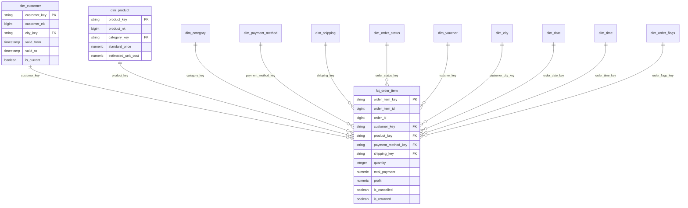

# Kimball Star Schema Design

## Business Process

The selected Kimball business process is online retail order management. The warehouse covers customer checkout, order item purchase, payment, voucher usage, shipping fulfillment, cancellation, return, and product profitability.

Procurement and suppliers are outside the scope.

## Grain

The core fact table is `analytics.fct_order_item`.

One row represents one product item purchased in a single customer order transaction.

If one order contains three products, the fact table has three rows.

## Star Schema Diagram



## Fact Table Design

| Fact table | Grain | Purpose |
| --- | --- | --- |
| `fct_order_item` | One product item in one customer order | Sales, payment, voucher, shipping, cancellation, return, profit, and customer/product analytics |

Degenerate dimensions in the fact:

| Column | Reason |
| --- | --- |
| `order_id` | Operational identifier for drill-through |
| `order_number` | Human-readable order reference |
| `item_number` | Line number inside the order |
| `sales_channel` | Low-cardinality source channel retained for direct filtering |
| `currency` | All generated rows use IDR, retained for extensibility |

## Dimension Table Design

| Dimension | Description | SCD Type |
| --- | --- | --- |
| `dim_customer` | Customer profile, loyalty tier, and address city | Type 2 |
| `dim_product` | Product SKU, name, price, estimated cost | Type 1 |
| `dim_category` | Product category and subcategory | Type 1 |
| `dim_payment_method` | E-wallet, QRIS, COD, Paylater | Type 1 |
| `dim_shipping` | Shipping provider, service, and SLA range | Type 1 |
| `dim_order_status` | Order lifecycle status and status group | Type 1 |
| `dim_voucher` | Voucher code, eligibility, and discount rules | Type 1 |
| `dim_city` | 34 Indonesian cities with province and region | Type 1 |
| `dim_date` | Calendar attributes | Static |
| `dim_time` | Minute-level time-of-day attributes | Static |
| `dim_order_flags` | Junk dimension for flags and cancellation stage | Type 1 |

## Measures Classification

| Measure | Classification | Reason |
| --- | --- | --- |
| `quantity` | Additive | Can be summed across all dimensions |
| `subtotal` | Additive | Line-level gross revenue before discounts |
| `discount_amount` | Additive | Item discount loss |
| `shipping_subsidy` | Additive | Shipping promo loss allocated to item |
| `voucher_amount` | Additive | Voucher loss allocated to item |
| `total_payment` | Additive | Net customer-paid amount |
| `estimated_cost` | Additive | Estimated product cost for profit analysis |
| `profit` | Additive | Net payment minus estimated cost and shipping subsidy |
| `unit_price` | Non-additive | Use average/min/max, not sum |
| `delivery_duration_minutes` | Non-additive | Use average, median, percentile, min, or max |
| `is_returned` | Semi-additive count flag | Sum as returned item count, average as return rate |
| `is_cancelled` | Semi-additive count flag | Sum as cancelled item count, average as cancellation rate |
| `profit_margin` | Non-additive derived measure | Calculate as `sum(profit) / sum(total_payment)` |
| `average_order_value` | Non-additive derived measure | Calculate as `sum(total_payment) / count(distinct order_id)` |

## Conformed Dimensions

| Dimension | Conformed Use |
| --- | --- |
| `dim_date` | Can be reused for order date, payment date, shipment date, and delivery date |
| `dim_time` | Can be reused for checkout time, payment time, and delivery time |
| `dim_city` | Can be reused for customer city, shipping destination city, or future store/warehouse city |
| `dim_category` | Shared product classification across sales, return, and profitability marts |
| `dim_payment_method` | Shared by order, payment, voucher recommendation, and finance marts |
| `dim_shipping` | Shared by fulfillment, cancellation, delay, and SLA marts |

## Role-Playing Dimensions

`dim_date` and `dim_time` are role-playing dimensions. The current fact table includes:

| Role | Key |
| --- | --- |
| Order date | `order_date_key` |
| Order time | `order_time_key` |
| Payment date | `payment_date_key` |

The raw shipment table also contains checkout, shipped, and delivered timestamps. Additional shipment and delivery date keys can be added if a separate shipping fact is built.

## Junk Dimension

`dim_order_flags` groups low-cardinality flags that should not become separate dimensions:

| Attribute |
| --- |
| `is_cancelled` |
| `is_returned` |
| `has_voucher` |
| `has_shipping_subsidy` |
| `is_delayed` |
| `cancellation_stage` |

This keeps the fact table compact and makes BI filtering easier.

## SCD Type 2 Strategy

`raw.customer_profile_events` stores customer profile changes as append-only events.

Tracked Type 2 attributes:

| Attribute |
| --- |
| `city_id` |
| `loyalty_tier` |
| `marketing_opt_in` |
| `email` |
| `full_name` |

dbt model `int_customer_scd2` creates version rows:

| Column | Description |
| --- | --- |
| `customer_key` | Surrogate key from `customer_id` and `valid_from` |
| `customer_nk` | Natural customer ID |
| `valid_from` | Version start timestamp |
| `valid_to` | Version end timestamp |
| `is_current` | Latest version flag |

The fact joins to the customer version valid at order time:

```sql
items.customer_id = customers.customer_nk
and items.order_ts >= customers.valid_from
and items.order_ts < customers.valid_to
```

This preserves historical address and loyalty-tier reporting.

## Design Decisions

Surrogate keys are generated by dbt using MD5 hashes, making joins stable and independent from source natural keys.

The order item fact is intentionally atomic. Higher-level order, customer, product, city, and monthly summaries are built as marts on top of the atomic fact.

Voucher and shipping subsidies are allocated to order items by subtotal proportion. This supports product-level profitability and promo-loss analysis.

Profit is estimated as `total_payment - estimated_cost - shipping_subsidy`. This is appropriate for a university analytical model because supplier/procurement data is out of scope.
